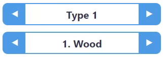

# SVG Sword Builder
Small app where you can **build a sword from predefined parts and materials**. This could be used as prototype for **basic crafting game**. The sword, it's parts and material gradients live inside an **SVG** file which was created in [LibreOffice Draw](https://libreoffice.org/discover/draw). The raw exported SVG needed to be modified to allow use of my planned document structure. Created with **HTML**, **CSS** and **JS**!


## Running dev-server and building the app
I used [Parcel](https://parceljs.org) for developing and building this app. It's actually my first time using it. Working good so far! At first I was a bit surprised by it's size (250 MB install, I am doing something wrong? :grinning:). Installing parcel (globally):
```batch
npm install -g parcel
```
Running dev-server (specifying source file):
```batch
parcel src/index.html
```
Running dev-server (using ```package.json```):
```batch
parcel
```
Building the app (using ```package.json```):
```batch
parcel build
```
More at [Building a web app with Parcel](https://parceljs.org/getting-started/webapp).
## Interesting bits



I created a simple JS module for creating the controls with horizontal arrows which you use for selecting the part type and material. The WIP name of this control is **Horizontal Arrow Combo Box**. It works by calling a JS function from the module to populate a wrapper div with the arrows and a list of options.
```html
<div class="hacb-wrapper" id="blade-type" data-loop="true"></div>
```
```js
import HACB from "./hacb";
const bladeTypes = ["Type 1", "Type 2", "Type 3"];
HACB.create("blade-type", bladeTypes);
```
The function returns the wrapper div element so that you can add an event listener for custom "value changed" event.
```javascript
HACB.create("blade-type", bladeTypes).addEventListener("changed", handlePartTypeChange);
```
The final rendered HTML looks something like this.
```html
<div class="hacb-wrapper" id="blade-type" data-loop="true">
    <button type="button" data-dir="left">◀</button>
    <div class="hacb-options">
        <div class="hacb-option hacb-option-active" data-value="type 1" data-index="0">Type 1</div>
        <div class="hacb-option" data-value="type 2" data-index="1">Type 2</div>
        <div class="hacb-option" data-value="type 3" data-index="2">Type 3</div>
    </div>
    <button type="button" data-dir="right">▶</button>
</div>
```
In the future I would like to expand this module into something usable and robust. I am sure there are already some solutions for this kind of control but writing this module was nice (and needed) experience.
