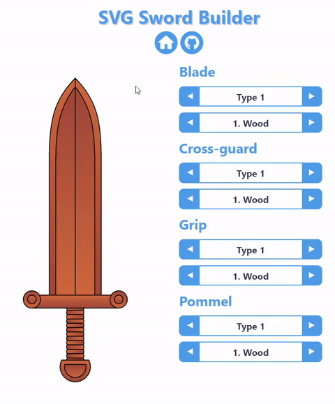

# SVG Sword Builder
GitHub repo for my small and simple web applications. These projects are a way for me to learn more about web dev and build my portfolio over time. The idea is to build many small web apps with different functionality and technologies. The bare minimum for every application is good functionality, basic responsiveness and simple "material" design.

